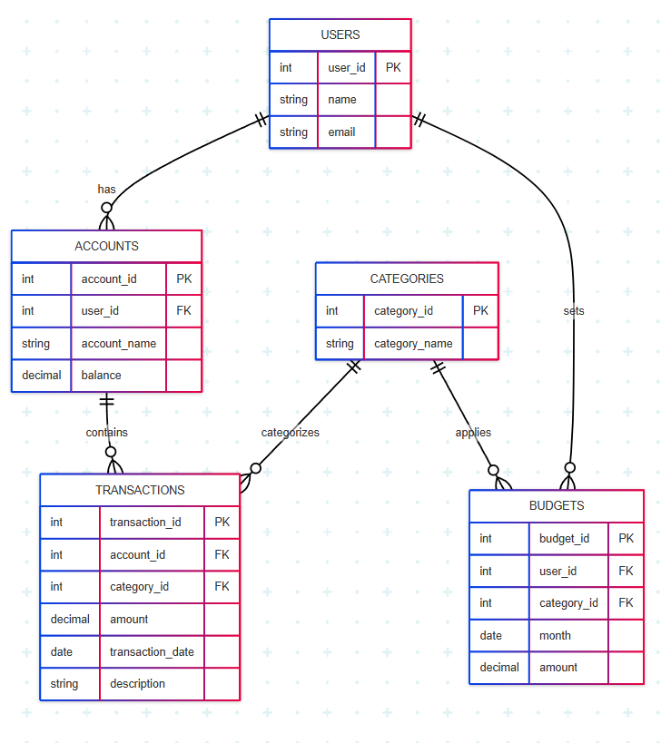

# Personal Finance Tracker

## Overview
The Personal Finance Tracker is a database designed to help users manage their financial activities by tracking bank account balances, transactions, budgets, and spending categories. Inspired by apps like Mint and Quicken, it provides a structured way to monitor income, expenses, and budget adherence, offering insights into financial health. This project is built for a single user but can be extended for multiple users or additional features like recurring transactions for collaborative efforts.

### Purpose
The purpose of this database is to empower users to organize and analyze their financial data. Users can:
- Track balances across multiple bank accounts.
- Categorize transactions (e.g., groceries, salary) to understand spending patterns.
- Set monthly budgets per category and compare them to actual spending.
- Generate reports like monthly spending summaries or remaining budget.

This tool is particularly useful for individuals seeking to manage personal finances without relying on external applications, offering a customizable and privacy-focused solution.

### Scope
The database includes:
- **Entities**: Users, bank accounts, transaction categories, transactions, and monthly budgets.
- **Functionality**: Create and manage accounts, log transactions, set budgets, and query financial data (e.g., account balances, spending by category, budget status).
- **Exclusions**: Real-time bank integration, multi-currency support, and complex forecasting are out of scope to keep the project manageable for a single developer. These could be added for a team project.

The database is implemented in SQLite, suitable for personal use, with potential for scaling to larger systems.

## Design

### Entities and Relationships
The database consists of five tables:
- **Users**: Stores user information (user_id, name, email).
- **Accounts**: Represents bank accounts (account_id, user_id, account_name, balance).
- **Categories**: Defines transaction categories (category_id, category_name, e.g., "Groceries").
- **Transactions**: Records financial activities (transaction_id, account_id, category_id, amount, transaction_date, description).
- **Budgets**: Stores monthly budget limits per category (budget_id, user_id, category_id, month, amount).

**Relationships**:
- A User has many Accounts (one-to-many).
- An Account has many Transactions (one-to-many).
- A Transaction belongs to one Category (many-to-one).
- A User has many Budgets, each linked to a Category and a specific month (one-to-many).

**Entity-Relationship Diagram**:

The ERD was created using Mermaid.js and exported as an image. It visually represents tables, their attributes, and relationships, with primary and foreign keys clearly marked.

### Optimizations
To ensure efficient performance:
- **Indexes**: An index (`idx_transactions_account_date`) on `transactions(account_id, transaction_date)` speeds up queries filtering by account and date, common in financial reports.
- **Normalization**: The database is in third normal form (3NF) to reduce redundancy. For example, categories are stored separately to avoid duplicating category names in transactions.
- **Views**: A `monthly_spending` view precomputes total spending per category per month, simplifying complex queries.
- **Data Types**: Appropriate data types (e.g., `DECIMAL(10,2)` for monetary values, `DATE` for dates) ensure accuracy and efficiency.

These optimizations balance query performance with storage efficiency, suitable for a personal finance application.

### Limitations
- **Single Currency**: The database assumes all transactions use one currency, limiting international use unless extended.
- **No Real-Time Integration**: It does not connect to bank APIs, requiring manual transaction entry.
- **No Recurring Transactions**: Automated recurring expenses (e.g., monthly subscriptions) are not supported, though this could be added for a team project.
- **Scalability**: Designed for personal use, the database may require adjustments (e.g., partitioning, additional indexes) for large-scale applications with many users.

These limitations keep the project feasible for a single developer while leaving room for future enhancements.

## Implementation
The database is implemented in SQLite, chosen for its simplicity and compatibility with CS50’s environment. The schema is defined in `schema.sql` with `CREATE TABLE`, `CREATE INDEX`, and `CREATE VIEW` statements. Sample queries in `queries.sql` demonstrate common operations like inserting transactions, checking balances, and comparing budgets to spending.

## Video Overview
A 3-minute screencast demonstrating the database is available at https://youtu.be/tX7ML1v_1KU
 The video includes:
- Project title: Personal Finance Tracker
- My name: Akash Narayankar
- GitHub username: akash274545
- edX username: Akash_Narayankar
- City and country: Kolhapur, India
- Date recorded: May 27, 2025
The video shows the schema creation, sample data insertion, and execution of key queries, highlighting the database’s functionality.

## Conclusion
The Personal Finance Tracker is a robust SQL database that addresses a real-world need for financial management. It demonstrates proficiency in database design, including normalization, indexing, and complex queries, while remaining practical and user-focused. Future improvements could include multi-currency support, recurring transactions, or a front-end interface, making it a strong foundation for a personal finance application.

This project was a rewarding opportunity to apply CS50 SQL concepts, and I’m proud of the result!
